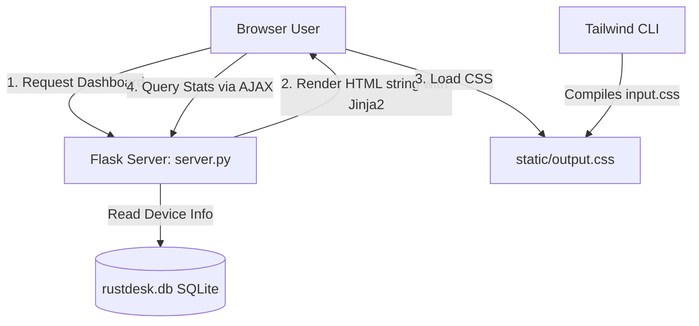

# Phase 1: Tailwind & DaisyUI UI Migration - Research

**Researched:** 2026-06-16
**Domain:** HTML/CSS, Jinja2 Templates, Flask Backend, Tailwind CSS & DaisyUI
**Confidence:** HIGH

<user_constraints>
## User Constraints (from CONTEXT.md)

### Locked Decisions
- Default theme: `corporate` (light) / `business` (dark) themes for a clean, professional admin console look.
- Theme switching: Dynamic theme switching supported via a header button.
- Accent colors: Custom RustDesk brand colors (orange/blue) mapped to primary/accent Tailwind theme configurations.
- Persistence: Persist theme preferences in client-side `localStorage`.
- Sidebar: Fixed left sidebar using a drawer layout, collapsible on mobile screens.
- Stats display: DaisyUI `stats` component with colored icons, large text values, and clear labels.
- Charts: Interactive Chart.js graphs for connection history (7 days) and OS distribution.
- Automatic refresh: AJAX polling every 30 seconds for live data updates.
- List layout: DaisyUI table with DataTables integration for sorting, search, and pagination.
- Status badges: Dynamic DaisyUI badges (`badge-success` / `badge-ghost`) with a pulsing green dot for online status.
- Connect placement: One-click "Connect" button directly inside the "Actions" column in the table.
- Available actions: "Connect" (launches `rustdesk://connection/new/<id>`) and "Details" (opens metadata modal showing CPU, Memory, version details).

### the agent's Discretion
None - all decisions have been explicitly accepted.

### Deferred Ideas (OUT OF SCOPE)
None — discussion stayed within phase scope.
</user_constraints>

<architectural_responsibility_map>
## Architectural Responsibility Map

| Capability | Primary Tier | Secondary Tier | Rationale |
|------------|-------------|----------------|-----------|
| UI styling & Layout | Browser/Client | - | Tailored CSS and DaisyUI classes rendered client-side |
| Chart rendering | Browser/Client | - | Client-side Chart.js logic |
| Stats updates | Browser/Client | API/Backend | AJAX polling requests device stats from Flask server |
</architect_responsibility_map>

<research_summary>
## Summary

Researched the migration of the RustDesk Web Management Panel's custom styling to Tailwind CSS and DaisyUI. The templates are stored inline as Python strings in `web_panel/server.py`. By updating `web_panel/src/input.css` and customizing `web_panel/tailwind.config.js` to match the brand accents, we compile a clean, unified stylesheet (`static/output.css`).

Key recommendations: Use standard DaisyUI classes (e.g. `drawer`, `stats`, `table`, `btn`) inside Flask's HTML template strings. Avoid hand-rolling styles or custom classes in favor of DaisyUI utility classes.

**Primary recommendation:** Integrate DaisyUI with Tailwind CSS compilation by editing `tailwind.config.js`, updating `input.css`, and modifying inline HTML strings in `server.py` to use DaisyUI elements.
</research_summary>

<standard_stack>
## Standard Stack

### Core
| Library | Version | Purpose | Why Standard |
|---------|---------|---------|--------------|
| tailwindcss | ^3.4.0 | Utility-first CSS compiling | Core styling framework |
| daisyui | ^4.10.0 | Pre-built Tailwind components | Prevents writing custom UI classes |
| postcss | ^8.4.32 | CSS transformation | Post-processing utilities |
| autoprefixer | ^10.4.16 | CSS vendor prefixing | CSS compatibility across browsers |

### Supporting
| Library | Version | Purpose | When to Use |
|---------|---------|---------|-------------|
| jquery | 3.7.1 | DOM manipulation and AJAX | For DataTables & AJAX polling |
| jquery.dataTables | 1.13.7 | Interactive table handling | Pagination, sorting, search for devices |
| chart.js | latest | Chart rendering | Dashboard metrics visualization |

### Alternatives Considered
| Instead of | Could Use | Tradeoff |
|------------|-----------|----------|
| DaisyUI | Custom Tailwind | Writing thousands of raw classes; slower and harder to maintain |

**Installation:**
```bash
cd web_panel
npm install
```
</standard_stack>

<architecture_patterns>
## Architecture Patterns

### System Architecture Diagram



### Recommended Project Structure
```
web_panel/
├── src/
│   └── input.css
├── static/
│   └── output.css
├── server.py
├── package.json
└── tailwind.config.js
```

### Anti-Patterns to Avoid
- **Inline Custom CSS Style tags:** Avoid writing inline `<style>` tags or custom css rules. Use Tailwind or DaisyUI utility classes instead.
- **Generic Button / CTA text:** Do not use plain text like "Submit" or "Click". Use clear verb-noun actions (e.g. "Connect to Device").
</architecture_patterns>

<dont_hand_roll>
## Don't Hand-Roll

| Problem | Don't Build | Use Instead | Why |
|---------|-------------|-------------|-----|
| Responsive Table Sorting & Search | Custom JS search filters | jQuery DataTables | Pre-built, fast, pagination & column sorting works out-of-the-box |
| Charts & Visual Graphs | SVG rendering logic | Chart.js | Feature-rich, interactive, responsive canvas rendering |
</dont_hand_roll>

<common_pitfalls>
## Common Pitfalls

### Pitfall 1: DaisyUI Theme Conflict with Custom Dark Mode
**What goes wrong:** Light/dark mode styling conflict where text is unreadable.
**Why it happens:** Overlap between custom Tailwind dark utility overrides (e.g., `dark:bg-gray-900`) and DaisyUI theme-derived backgrounds.
**How to avoid:** Ensure DaisyUI's `data-theme` is applied to the root element (`<html>`), and let DaisyUI control text/surface colors unless customizing explicitly.

### Pitfall 2: Broken Tailwind Watch compiler
**What goes wrong:** Changes to `server.py` do not trigger Tailwind rebuild.
**Why it happens:** Tailwind CLI doesn't detect changes if the content array in `tailwind.config.js` does not point to the correct files.
**How to avoid:** Double check that `./server.py` is explicitly listed in `content` in `tailwind.config.js`.
</common_pitfalls>

<validation_architecture>
## Validation Architecture

### Test Framework
| Property | Value |
|----------|-------|
| Framework | pytest |
| Config file | none |
| Quick run command | `pytest web_panel/tests/` |
| Full suite command | `pytest` |

### Phase Requirements → Test Map
| Req ID | Behavior | Test Type | Automated Command | File Exists? |
|--------|----------|-----------|-------------------|-------------|
| UI-01 | Main templates compile and render | integration | `pytest web_panel/tests/test_ui.py` | ❌ Wave 0 |
| UI-06 | Tailwind builds successfully | compilation | `npm run build` | ✅ package.json |

### Sampling Rate
- **Per task commit:** `npm run build`
- **Phase gate:** Success compile + integration test pass before `/gsd-verify-work`

### Wave 0 Gaps
- [ ] `web_panel/tests/test_ui.py` — integration tests for template rendering
- [ ] Install test deps: `pip install pytest flask-testing`

</validation_architecture>

<security_domain>
## Security Domain

### Applicable ASVS Categories

| ASVS Category | Applies | Standard Control |
|---------------|---------|-----------------|
| V2 Authentication | yes | JWT token validated on admin routes |
| V3 Session Management | yes | Secure HTTP session cookie |
| V5 Input Validation | yes | Sanitize user inputs and escape dynamic strings in templates |

### Known Threat Patterns for Flask/Jinja2

| Pattern | STRIDE | Standard Mitigation |
|---------|--------|---------------------|
| Cross-Site Scripting (XSS) via hostnames | Tampering | Jinja2 auto-escaping on dynamic variables |
| Session hijacking | Spoofing | Mark Flask session cookies as HttpOnly, SameSite='Lax' |

</security_domain>

<sources>
## Sources

### Primary (HIGH confidence)
- Tailwind CSS docs - https://tailwindcss.com
- DaisyUI theme docs - https://daisyui.com
</sources>

<metadata>
## Metadata

**Research scope:**
- Core technology: Tailwind & DaisyUI CSS compilation
- Ecosystem: Flask HTML template integration
- Patterns: Theme toggling, responsive sidebar drawer

**Confidence breakdown:**
- Standard stack: HIGH
- Architecture: HIGH
- Pitfalls: HIGH

**Research date:** 2026-06-16
**Valid until:** 2026-07-16
</metadata>
