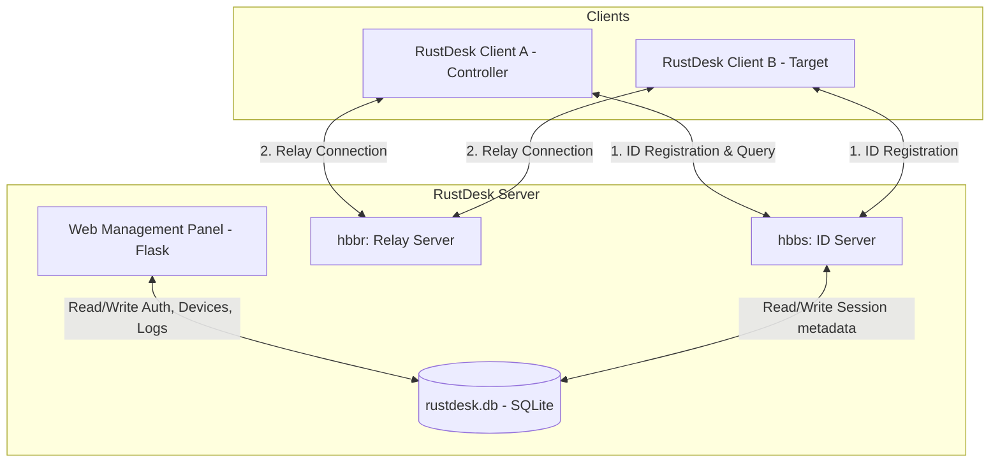

# Architecture Diagram & Component Interaction

## Component Diagram

The following diagram shows how RustDesk clients interact with the ID/Relay server and how the Web Management Panel manages the system database and components:

## Communication Patterns

### 1. Peer-to-Peer vs Relayed Connections
* **Registration**: Upon startup, both clients contact `hbbs` to register their unique IDs and announce their presence.
* **Direct Coordination**: When Client A requests connection to Client B, it queries `hbbs` for Client B's address. `hbbs` attempts to coordinate a direct hole-punching UDP connection.
* **Relay Fallback**: If a direct connection cannot be negotiated (due to symmetric NATs/firewalls), `hbbs` instructs both clients to establish connection paths through the `hbbr` relay server.

### 2. Web Management Coordination
* The **Web Management Panel** acts as the user interface for `rustdesk.db`.
* Administrators log in using the panel. The panel communicates directly with SQLite database `rustdesk.db` located at an absolute, isolated file path, preventing split/duplicate databases.
* The backend exposes REST APIs (`/api/devices`, `/api/admin/users/*`) and renders HTML views using Flask template rendering.
