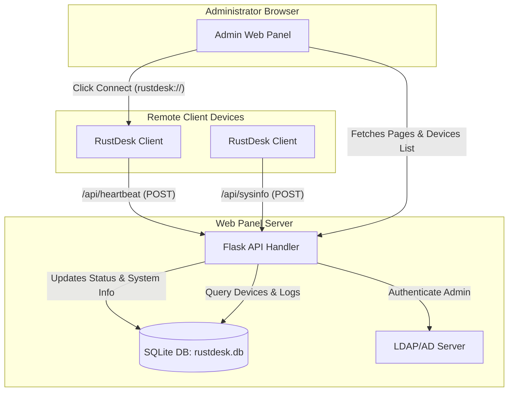

# Architecture Diagram

The diagram below outlines the communication flows between the RustDesk client devices, the Web Panel server, and the administrator browser.

## Communication Patterns
1. **Device Heartbeats:** Background pings occur asynchronously from clients directly to the server's HTTP endpoints.
2. **Web Operations:** Synchronous requests from the administrator browser to retrieve HTML templates populated with SQLite data.
3. **Connection launcher:** Browser triggers URI scheme `rustdesk://connection/new/<device_id>`, invoking the local RustDesk desktop application directly.
