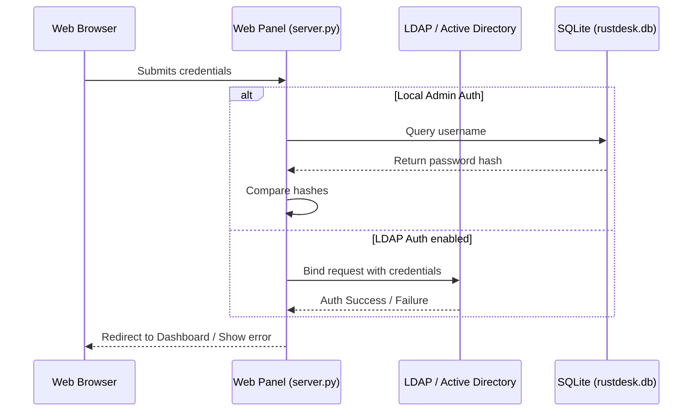
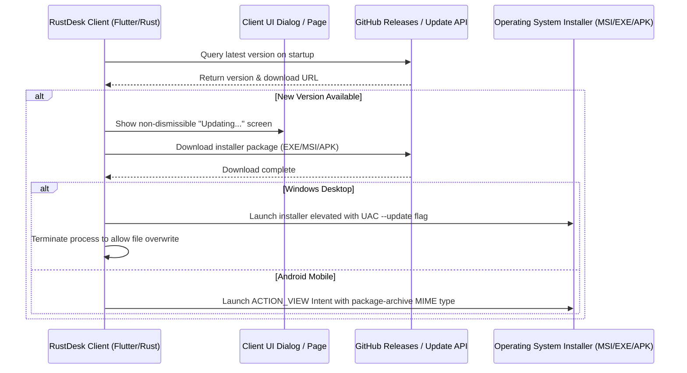

# Data Flow Documentation

## 1. Authentication Flow

## 2. Device Registration and Status Monitoring
1. **Heartbeat**: RustDesk client periodically sends a heartbeat payload containing hostname, current username, OS info, local IP, and client version to `hbbs`.
2. **Persistence**: `hbbs` writes the connection status, last seen timestamp, and IP coordinates to `rustdesk.db`.
3. **Rendering**:
   - The user opens the Web Panel.
   - `server.py` queries `rustdesk.db` for all devices.
   - For each device, `server.py` checks if `last_seen` is under 30 seconds ago to flag it as "Online".
   - Devices table is populated and sorted by last seen date using jQuery DataTables.

## 3. Passwordless Connection Flow
1. **Request**: The user navigates to the "My Devices" section and clicks "Connect" next to their device.
2. **Resolution**: The web application retrieves the registered unattended password and the configured ID Server IP address.
3. **Protocol Launch**: The browser triggers the custom protocol link: `rustdesk://<id>@<server>?password=<encoded_password>`.
4. **Connection**: The local RustDesk client opens, parses the URL parameters, sets the server IP, passes the password credential automatically, and establishes the remote control session without prompting the user.

## 4. Address Book and Password Sync Flow
1. **Device Association**: When a user logs in to their account on any RustDesk client device, the client sends an authentication request to the `/api/login` endpoint. The server automatically links the device to the user's account (`devices.user_id = user.id`).
2. **Address Book Sync**:
   - The client app queries the address book via `/api/ab/get`.
   - The server dynamically fetches the user's personal address book data and merges their own devices into the peers list, pre-filling saved passwords.
   - The client app receives this merged list, meaning all owned devices automatically appear in the client's Address Book.
3. **Bidirectional Password Update**:
   - If a user updates the connection password in the client app's address book, the client app posts the update via `POST /api/ab`.
   - The server intercepts the post, extracts the passwords, and automatically updates the `password` field in the `devices` table for the corresponding devices owned by the user.
   - If the user edits the password in the Web Panel, it updates the `devices` table, which is automatically included in the next `/api/ab/get` sync payload received by all of the user's clients.

## 5. Forced Automatic Update Flow

