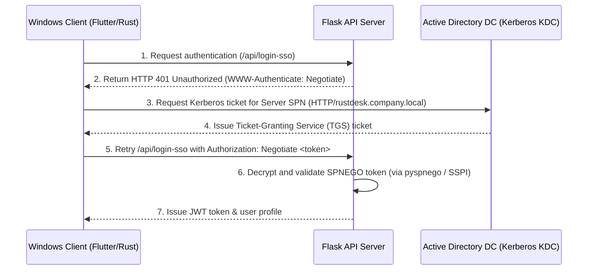

# Integration Documentation

## LDAP / Active Directory Integration

### 1. Purpose
Enables enterprise-wide Single Sign-On (SSO) for remote control administrators using existing organizational directories (Active Directory or openLDAP).

### 2. Authentication Flow
Authentication is performed using the simple bind method:
* Connects to the Active Directory domain controller.
* Authenticates the service account (Bind DN).
* Queries for the target user's distinguished name (DN).
* Tries to bind with the target user's DN and their password to verify credentials.

### 3. API Usage
* **Endpoint**: `/api/ldap/test` (POST)
* **Payload**:
  ```json
  {
    "server": "ldap://dc.company.local",
    "username": "bind_user@company.local",
    "password": "secret_password"
  }
  ```
* **Response**:
  ```json
  {
    "success": true,
    "message": "Connection test successful! Root Base DN discovered.",
    "base_dn": "DC=company,DC=local"
  }
  ```

### 4. Error Handling
* Connection timeouts or network failures are caught and displayed as "Connection test failed: <error>" with `aria-live="polite"` tags.
* Missing system requirements (e.g. `ldap3` package not installed) are flagged inline with remediation recommendations (e.g. `pip install ldap3`).

## Client-Server Passwordless Connection Integration

### 1. Purpose
Enables automatic, secure, passwordless connections between remote desktop client devices (Windows, Android, etc.) that are logged into the same central user account.

### 2. Device Association Flow
* **Login / Status Check**: When a user logs in via `/api/login` or when the client checks current user info via `/api/currentUser`, it sends the client's `id` (device ID) and `uuid`.
* **Automatic Link**: The server automatically registers the device in the `devices` database table and links it to the logged-in user's `user_id`.

### 3. Address Book Sync & Passwordless Tagging
* When the client fetches their address book via `/api/ab` or `/api/ab/get`, the server dynamically queries all devices linked to that user's ID.
* The server merges these owned devices into the returned address book peers list and automatically appends the special tag `"same-account"` to their tags list.
* The client's connection logic (`src/client.rs`) detects the `"same-account"` tag and skips showing the password entry dialog, directly initiating a connection request.

### 4. Connection Handshake Verification
* During the connection handshake, the target host checks if the incoming connection has an `access_token`.
* The host calls `{api_server}/api/currentUser` using the incoming connection's `bearer_auth(access_token)`.
* If the API server returns a valid username that matches the host's own logged-in username, the host authorizes the remote session passwordlessly, bypassing password validation.

## Kerberos Single Sign-On (SSO) Integration

### 1. Purpose
Provides passwordless Single Sign-On (SSO) login for domain-joined Windows desktop clients using their Active Directory credentials automatically upon client startup.

### 2. Authentication Flow

1. **SSO Init**: The client sends a request to the server's SSO login endpoint `/api/login-sso`.
2. **Negotiate Challenge**: The server responds with `401 Unauthorized` and a `WWW-Authenticate: Negotiate` header.
3. **Kerberos Ticket Acquisition**: The client calls the Windows SSPI library (via Rust FFI to `secur32.dll` and functions `InitializeSecurityContext`/`AcceptSecurityContext`) to request a Kerberos service ticket for the server's Service Principal Name (SPN).
4. **Negotiate Response**: The client retries the request to `/api/login-sso` with the base64-encoded token in the `Authorization: Negotiate <token>` header.
5. **Token Verification**: The server validates the Kerberos token against the Domain Controller (using a keytab file and GSSAPI/`pyspnego` library).
6. **JWT Issuance**: Once authenticated, the server maps the Windows sAMAccountName/UPN to the user database, determines the user's role (Admin vs User), and returns a standard JWT access token to log the client in automatically without password prompt.

### 3. Server Configuration & SPN Registration
To enable Kerberos SSO, administrators must register a Service Principal Name (SPN) in Active Directory for the service account running the RustDesk API server:
```cmd
setspn -s HTTP/rustdesk-server.company.local domain_service_account
```
For Linux-based Flask deployments, a keytab file must be generated on the Domain Controller and stored securely on the Flask host:
```cmd
ktpass /out rustdesk.keytab /princ HTTP/rustdesk-server.company.local@COMPANY.LOCAL /mapuser domain_service_account /pass password /crypto All /ptype KRB5_NT_PRINCIPAL
```

### 4. Co-existence & Fallback Flow
Kerberos SSO runs as an optional, parallel authentication pathway and does not lock out local or non-domain users:
1. **SSO Attempt**: On startup, clients on domain-joined machines automatically attempt passwordless Kerberos authentication via the `/api/login-sso` Negotiate handshake.
2. **Standard Fallback**: If the SSO attempt fails (e.g., non-domain computer, missing Kerberos ticket) or is not supported by the platform (e.g., Android mobile devices), the client client-side UI falls back to the standard login screen.
3. **Multi-source Credentials Validation**: On the login screen:
   - **Active Directory Users**: Can log in using their AD username/password, validated by the server via LDAP simple bind.
   - **Local Users**: Local accounts (e.g. `admin` or other offline administrators) bypass LDAP/SSO entirely, with credentials checked against the local SQLite database.
